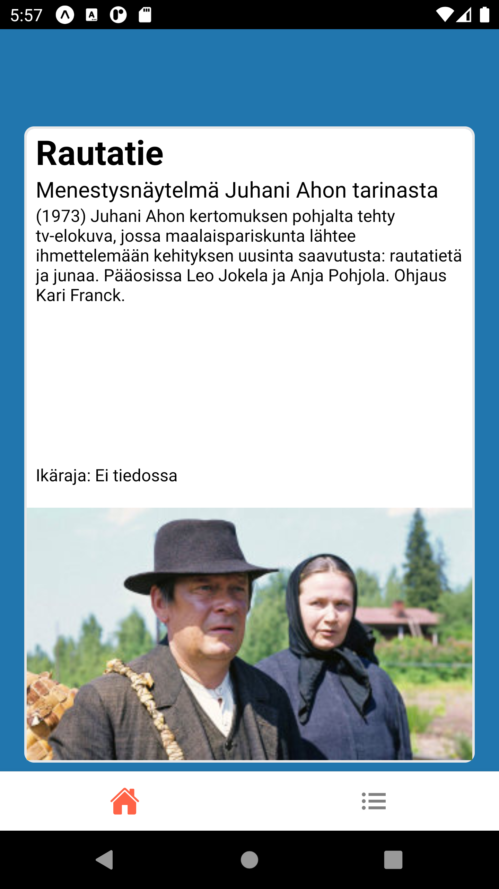

# DataTinder application

This repository is a React Native application for https://github.com/jussihayha/DataTinderit -project.  
You need to be aware that this application is highly tailored for the backend we used.

You can check https://github.com/bgf122/dataTinderBack on how to deploy your own backend.

This is a basic application that uses localStorage to identify user (using uuid) and demonstrates a backend serving  
recommendations in a "Tinder"-kind of way.

Our original authentication method was Firebase, but that was scrapped for creating a no-fuss kind  
scenario for the enduser.




  
## Getting Started

These instructions give you an overview on how to take advantage of this repository.  
Your mileage may wary though and some heavy forking might be necessary to get this up and running for your needs.

### Prerequisites

Before you start, you need to setup your own backend. 
You need atleast these packages to develop on your local machine

* Expo
* NPM
* Android emulator (recommended)


### Installation

A step by step guide that will tell you how to get the development environment up and running.


```
$ git clone https://github.com/laurahyvari/DataTinderiFront
$ npm install
$ npm start
```


## Userflow

The app is designed so that when the user opens it for the first time, it gives a small explanation  
on how it works.  
  
After the introscreen you are greeted with a Tinderlike swipeable screen that you can use to give votes
on items that the backend server gives you.

There is a second tab where the app fetches recommendations and popular items from the backend. 
The second tab has a stacknavigator also so that you can open itemdetails.

This is a POC project so the main functionality of this app is to demonstrate how the backend recommender works
and validate its success.


### Live-example & backend

Example server is running for a short period at https://neksu.vps.webdock.io  
Should you open that link in a browser, I should advice you to use mobile views via Developer Console.

If you intend to clone this repository you can use that site as a backend also (for a short period of time).

### Branches

* Master branch is the working version and other branches might have content that are no longer viable.

